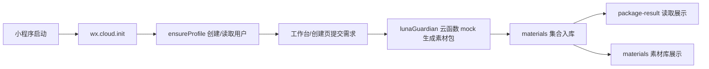

# CloudBase 国内化切换记录

更新时间：2026-05-27

## 已完成

- 前端环境切到 `TARO_APP_CLOUDBASE_ENV_ID=cloud1-d3g0qen9b36b6a0b8`。
- `src/app.config.ts` 已增加 `cloud: true`。
- `project.config.json` 已增加 `cloudfunctionRoot: "cloudfunctions/"`。
- 新增 `src/client/cloudbase.ts`，统一封装：
  - `wx.cloud.init`
  - `wx.cloud.callFunction`
  - `wx.cloud.uploadFile`
  - 本地用户缓存
- `AuthContext` 已从 Supabase Auth 改成 CloudBase：
  - 微信身份登录：`ensureProfile`
  - 自建账号登录/注册：`accountAuth`
  - 退出登录：清本地缓存
- `src/db/api.ts` 已从 Supabase 查询改成 `dbApi` 云函数。
- 上传层已从 Supabase Storage/COS 直连改成 CloudBase 云存储。
- 工作台、创建素材包、素材库、结果页、客服、个人中心、套餐、算力充值、财务、账号安全的 Supabase 主动调用已清除。
- 新增云函数骨架：
  - `ensureProfile`
  - `accountAuth`
  - `dbApi`
  - `lunaGuardian`
  - `customerService`
  - `arkModelPricing`
  - `createWechatPayment`
  - `financeDailyCalc`

## 当前能跑的最小闭环

## 当前仍是占位的能力

- Hermes 真实生成：`lunaGuardian` 目前先返回 mock 素材包，下一步把 Hermes API 接入云函数。
- 支付：`createWechatPayment` 目前返回未配置提示，不会拉起真实支付。
- 财务跑批：`financeDailyCalc` 目前是占位成功。
- 客服：`customerService` 目前保存用户消息并返回固定回复。
- COS 最终域名：当前上传先落 CloudBase 云存储，后续可在云函数内同步到腾讯 COS 的 `users/{openid}/uploads/` 和 `outputs/`。

## 微信开发者工具下一步

1. 打开项目后确认云开发环境为 `cloud1-d3g0qen9b36b6a0b8`。
2. 右键 `cloudfunctions/ensureProfile`，上传并部署：云端安装依赖。
3. 依次部署：
   - `accountAuth`
   - `dbApi`
   - `lunaGuardian`
   - `customerService`
   - `arkModelPricing`
   - `createWechatPayment`
   - `financeDailyCalc`
4. 云数据库建议先创建集合：
   - `profiles`
   - `materials`
   - `cs_messages`
   - `orders`
   - `compute_recharges`
   - `usage_records`
   - `announcements`
5. 重新编译小程序，先测：
   - 微信一键登录
   - 自建账号注册/登录
   - 工作台发一条文字生成素材包
   - 跳转结果页
   - 素材库能看到生成结果
   - 客服能发送消息

## 验证结果

- `taro build --type weapp` 成功。
- `scripts/patchWeappDist.mjs` 已执行。
- `dist/app.json` 已包含 `"cloud": true`。
- `dist/base.wxml` 包含 `tmpl_0_14`。
- `dist/base.wxml` 不含导致旧警告的 `padding="{{i.p12...`。
- `src` 和 `dist` 中未检出 Supabase 主动调用或旧秒哒域名。
