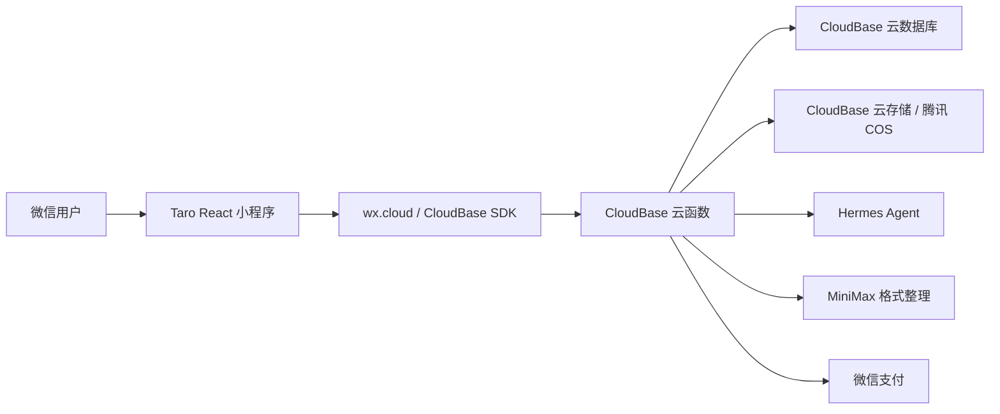
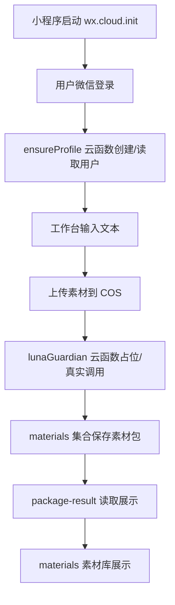
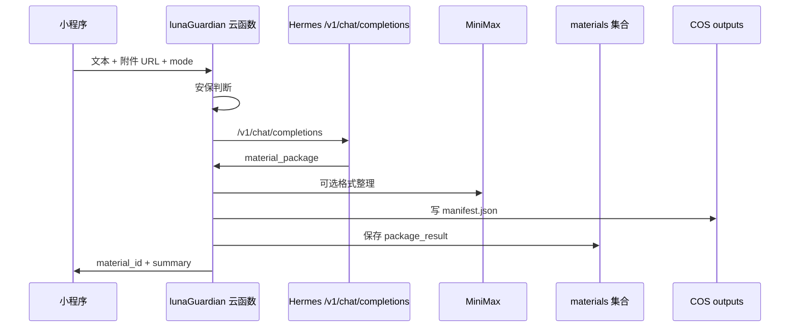

# Luna 小程序国内化后端迁移方案：Supabase -> CloudBase

更新时间：2026-05-27

## 1. 结论

当前项目建议迁到 **腾讯云开发 CloudBase / 微信云开发**，不要继续依赖 Supabase 作为主后端。

原因：

- 微信小程序可以直接用 `wx.cloud.callFunction` 调云函数，天然携带用户身份。
- 云函数侧可以拿到 `OPENID`，适合做用户隔离、素材空间隔离、微信支付、Hermes 中转。
- 国内访问稳定性和微信生态适配更好。
- 当前前端页面已经基本成型，迁移重点应放在后端适配层，不建议重写 UI。

官方能力参考：

- CloudBase 内置数据库、存储、身份认证、云函数、云托管等服务。
- 微信小程序调用 CloudBase 云函数可以使用小程序 SDK，并自动携带用户身份。
- CloudBase 云函数可通过 Node SDK 调用数据库、云存储和其他云函数。

## 2. 目标架构



建议保留腾讯 COS 作为最终素材库空间，CloudBase 负责身份、函数和数据库。原因是你已经有 COS 公网域名：

```text
https://wechat-app-1409532217.cos-website.ap-beijing.myqcloud.com
```

素材路径继续采用：

```text
users/{openid 或 userId}/uploads/
users/{openid 或 userId}/outputs/
```

## 3. 现有模块迁移映射

| 当前 Supabase 模块 | 迁移到 CloudBase 后 | 说明 |
| --- | --- | --- |
| `supabase.auth` | `wx.cloud` 登录态 + `OPENID` | 微信一键登录天然支持；自建账号可作为 `profiles` 里的绑定方式 |
| `profiles` 表 | `profiles` 集合 | 以 `openid` 为主键或唯一索引 |
| `materials` 表 | `materials` 集合 | 保存素材包结果、来源模式、COS manifest |
| `orders` 表 | `orders` 集合 | 微信支付订单 |
| `compute_recharges` 表 | `compute_recharges` 集合 | 算力充值流水 |
| `cs_messages` 表 | `cs_messages` 集合 | 客服消息 |
| `usage_records` 表 | `usage_records` 集合 | AI 调用/扣费记录 |
| `social_accounts` 表 | `social_accounts` 集合 | 热点追踪账号绑定 |
| `analytics_data` 表 | `analytics_data` 集合 | 热点/账号数据 |
| Supabase RLS | 云函数强制按 `openid` 过滤 | 不让前端直接写敏感集合 |
| Edge Functions | `cloudfunctions/*` | 每个函数迁成一个云函数 |
| Supabase Storage | CloudBase 存储或 COS | 头像/客服图可用 CloudBase，素材库建议继续 COS |

## 4. 需要保留的代码

这些可以继续保留：

- `src/pages/chat/index.tsx`
- `src/pages/features/index.tsx`
- `src/pages/service/index.tsx`
- `src/pages/profile/index.tsx`
- `src/pages/login/index.tsx`
- `src/pages/package-create/index.tsx`
- `src/pages/package-result/index.tsx`
- `src/pages/materials/index.tsx`
- `src/pages/pricing/index.tsx`
- `src/pages/orders/index.tsx`
- `src/pages/monitor/index.tsx`
- `src/pages/usage-records/index.tsx`
- `src/pages/admin-finance/index.tsx`
- 现有 Tailwind/Taro 构建配置
- `src/db/types.ts` 里的业务类型，大部分字段可复用
- `luna_guardian` 里的安保层、路由层、格式修复思路

## 5. 建议重写/替换的代码

| 文件/模块 | 建议 |
| --- | --- |
| `src/client/supabase.ts` | 新增 `src/client/cloudbase.ts`，最终替换 Supabase 客户端 |
| `src/contexts/AuthContext.tsx` | 改为 CloudBase 微信登录 + 自建账号绑定 |
| `src/db/api.ts` | 新增 `src/db/cloudbaseApi.ts`，逐步迁移 CRUD |
| `src/utils/cos.ts` | 保留上传接口形状，底层改成调用 CloudBase 云函数拿 COS 上传凭证 |
| `supabase/functions/*` | 迁到 `cloudfunctions/*` |
| `RouteGuard` | 补真实登录拦截 |
| 支付函数 | 改成 CloudBase 云函数内调用微信支付 |

## 6. 第一阶段最小闭环

第一阶段不要一次性迁完整项目，只跑通基础业务：



验收标准：

- 微信开发者工具和真机都能启动，无白屏。
- 登录后能拿到 `openid`。
- `profiles` 集合能创建用户。
- 上传文件进入当前用户前缀。
- `lunaGuardian` 即使先不连 Hermes，也能返回标准素材包 mock。
- `materials` 集合能保存和读取。
- 结果页、素材库能展示同一条素材包。

## 7. 第二阶段接 Hermes

第二阶段再把生成链路接真实 Hermes：



## 8. 第三阶段补齐支付和运营

支付和运营建议放到第三阶段，避免基础业务还没稳就引入支付复杂度：

- 微信支付下单
- 支付回调
- 订单状态轮询
- 会员/余额刷新
- 用量记录
- 管理员财务页
- 热点账号绑定和采集

## 9. CloudBase 集合设计

### profiles

```json
{
  "_id": "openid 或 userId",
  "openid": "微信 openid",
  "username": "自建账号名，可选",
  "password_hash": "自建账号密码哈希，可选",
  "nickname": "昵称",
  "avatar_url": "头像",
  "role": "user",
  "is_admin": false,
  "membership_level": "free",
  "balance": 0,
  "ai_count": 0,
  "bound_accounts": 0,
  "created_at": "ISO 时间",
  "updated_at": "ISO 时间"
}
```

### materials

```json
{
  "_id": "material id",
  "user_id": "openid 或 userId",
  "type": "work",
  "title": "素材包标题",
  "content": "摘要",
  "source_mode": "material 或 direction",
  "package_config": {},
  "package_result": {},
  "manifest_key": "users/{user}/outputs/{material}/manifest.json",
  "manifest_url": "COS URL",
  "created_at": "ISO 时间"
}
```

### assets

```json
{
  "_id": "asset id",
  "user_id": "openid 或 userId",
  "key": "users/{user}/uploads/file.png",
  "url": "COS URL",
  "name": "file.png",
  "type": "image",
  "size": 12345,
  "created_at": "ISO 时间"
}
```

### cs_messages

```json
{
  "_id": "message id",
  "user_id": "openid 或 userId",
  "role": "user 或 assistant",
  "content": "消息",
  "image_url": null,
  "message_type": "text",
  "is_read": true,
  "created_at": "ISO 时间"
}
```

## 10. 云函数清单

第一阶段必须做：

| 云函数 | 替代原函数 | 作用 |
| --- | --- | --- |
| `ensureProfile` | `auth_ensure_profile` | 获取 openid，创建/读取 profile |
| `cosCredential` | `cos_credential` | 下发当前用户前缀的 COS 上传参数 |
| `cosListFiles` | `cos_list_files` | 只列当前用户前缀文件 |
| `lunaGuardian` | `luna_guardian` | 安保、任务识别、生成素材包、保存 materials |
| `getMaterial` | DB API | 读取单个素材包 |
| `listMaterials` | DB API | 读取当前用户素材包 |

第二阶段做：

| 云函数 | 作用 |
| --- | --- |
| `customerService` | 客服消息 |
| `updateProfile` | 昵称、头像 |
| `usageRecords` | 用量记录 |
| `xhsPublicCollect` | 小红书公开数据采集 |

第三阶段做：

| 云函数 | 作用 |
| --- | --- |
| `createWechatPayment` | 微信支付下单 |
| `wechatPaymentCallback` | 支付回调 |
| `financeDailyCalc` | 财务日报 |
| `arkModelPricing` | 模型价格和充值包 |

## 11. 前端改造文件清单

| 文件 | 改造内容 |
| --- | --- |
| `src/app.tsx` | 启动时初始化 `wx.cloud.init({ env })` |
| `src/client/cloudbase.ts` | 新增云函数调用、数据库调用、登录辅助 |
| `src/contexts/AuthContext.tsx` | 改成微信云开发身份 + 自建账号绑定 |
| `src/db/cloudbaseApi.ts` | 新增 CloudBase CRUD |
| `src/utils/cos.ts` | `getCosCredential` 改调 CloudBase 云函数 |
| `src/pages/chat/index.tsx` | `callLunaGuardian` 改调 `wx.cloud.callFunction` |
| `src/pages/package-create/index.tsx` | 调用 CloudBase `lunaGuardian` |
| `src/pages/package-result/index.tsx` | 读取 CloudBase `getMaterial` |
| `src/pages/materials/index.tsx` | 读取 CloudBase `listMaterials`/`cosListFiles` |
| `src/pages/service/index.tsx` | 后续改 `customerService` |

## 12. 环境变量/配置

小程序前端只需要：

```env
TARO_APP_CLOUDBASE_ENV_ID=你的云开发环境 ID
TARO_APP_APP_ID=wxafa7c1f999935fdc
TARO_APP_COS_PUBLIC_BASE_URL=https://wechat-app-1409532217.cos-website.ap-beijing.myqcloud.com
```

云函数 Secrets 需要：

```text
TENCENT_SECRET_ID
TENCENT_SECRET_KEY
COS_BUCKET
COS_REGION
COS_PUBLIC_BASE_URL
HERMES_BASE_URL
HERMES_API_KEY
HERMES_MODEL
MINIMAX_API_KEY
MINIMAX_BASE_URL
WECHAT_PAY_MCH_ID
WECHAT_PAY_API_V3_KEY
WECHAT_PAY_CERT_SERIAL_NO
WECHAT_PAY_PRIVATE_KEY
```

## 13. 微信后台需要配置

如果用 `wx.cloud.callFunction` 直连云函数，很多原先 request 合法域名问题会少很多。

仍然需要关注：

- COS 上传域名
- COS 下载/图片展示域名
- 如果 Hermes 不经过云函数而由前端直连，不建议这样做，也需要合法域名
- 微信支付商户平台回调地址

建议全部第三方接口都放云函数里，不让小程序前端直接请求。

## 14. 执行顺序

1. 在微信开发者工具或腾讯云控制台开通云开发环境。
2. 记录环境 ID，填入 `TARO_APP_CLOUDBASE_ENV_ID`。
3. 新建 `cloudfunctions/ensureProfile`。
4. 前端接入 `wx.cloud.init` 和 `ensureProfile`。
5. 新建 `profiles` 集合，验证登录能创建用户。
6. 新建 `cloudfunctions/cosCredential`，验证上传只进当前用户前缀。
7. 新建 `cloudfunctions/lunaGuardian`，先返回 mock 素材包并写 `materials`。
8. 改前端 `chat/package-create/package-result/materials` 读取 CloudBase。
9. 真机测试基础闭环。
10. 接 Hermes。
11. 接客服。
12. 接支付。
13. 做送审前权限、内容安全、域名、隐私协议检查。

## 15. 当前需要用户提供的信息

第一阶段马上需要：

- CloudBase 环境 ID，例如 `prod-xxxx`
- 腾讯云 COS Bucket，例如 `wechat-app-1409532217`
- COS Region，例如 `ap-beijing`
- 腾讯云 SecretId/SecretKey，建议使用最小权限子账号

第二阶段需要：

- Hermes 地址和 API Key
- MiniMax API Key

第三阶段需要：

- 微信支付商户号
- API v3 密钥
- 商户私钥/证书序列号

