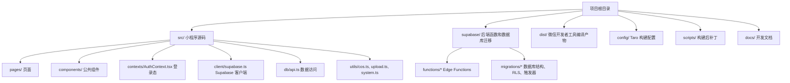
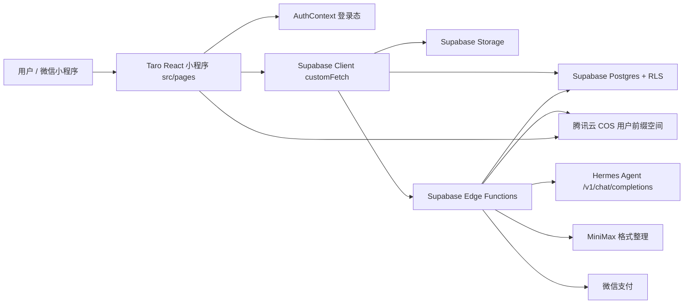
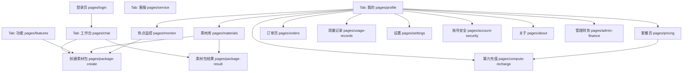
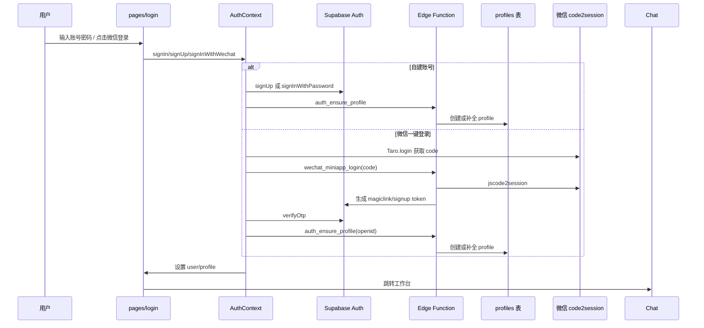
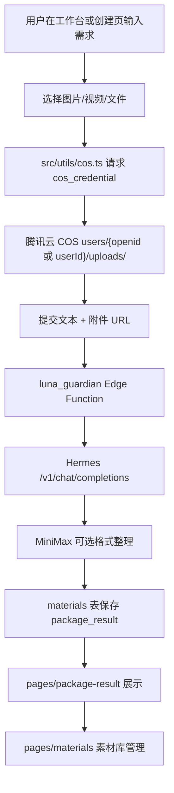
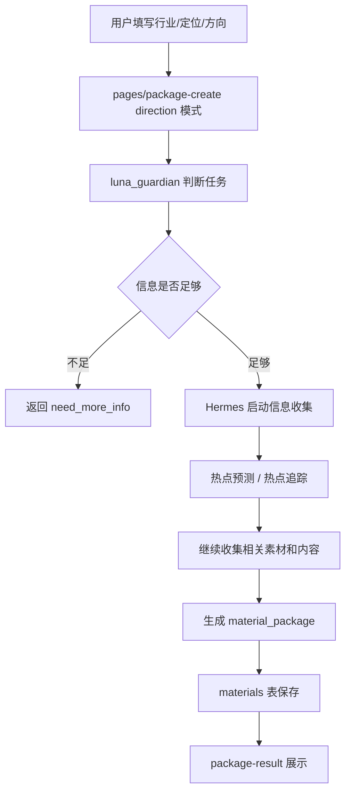
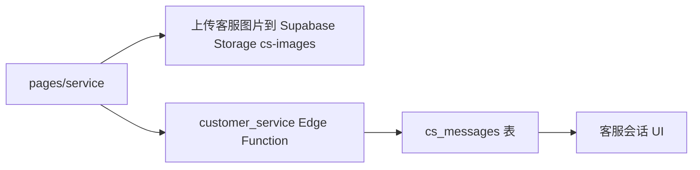
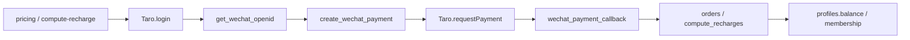

# Luna 小程序架构、流程与测试准备

更新时间：2026-05-27

## 1. 当前项目结构

关键位置：

| 类型 | 位置 | 说明 |
| --- | --- | --- |
| 小程序入口 | `src/app.tsx`, `src/app.config.ts` | 注册页面、TabBar、全局 Provider |
| 页面 | `src/pages/*/index.tsx` | 工作台、功能、客服、我的、登录、套餐、素材库、结果页等 |
| 登录态 | `src/contexts/AuthContext.tsx` | 自建账号、微信一键登录、profile 补全 |
| Supabase 客户端 | `src/client/supabase.ts` | 小程序环境下通过 `Taro.request` 替代 fetch |
| 数据访问 | `src/db/api.ts` | profiles、materials、orders、messages、usage_records 等表 |
| 文件上传 | `src/utils/cos.ts`, `src/utils/upload.ts` | COS 素材上传、Supabase Storage 头像/客服图片上传 |
| 后端函数 | `supabase/functions/*/index.ts` | AI、登录、COS、支付、客服、财务、素材生成 |
| 数据库/RLS | `supabase/migrations/migration.sql` | 表结构、RLS、策略、触发器 |
| 微信编译目录 | `dist/` | `project.config.json` 的 `miniprogramRoot` 指向这里 |

## 2. 总体架构图

当前判断：

- 小程序端可以脱离秒哒平台构建和运行，微信开发者工具读取的是 `dist/`。
- 真正业务要跑通，必须有 Supabase URL、Anon Key、Edge Functions、数据库迁移、RLS、COS Secret、Hermes/模型 Secret、微信登录/支付配置。
- 当前本地未配置有效 `TARO_APP_SUPABASE_URL` 时，前端会进入本地演示兜底，不会访问旧的 `backend.appmiaoda.com`。

## 3. 页面流转图

注意：`src/components/RouteGuard.tsx` 目前没有真正做未登录拦截，只是直接渲染页面。全链路测试时要单独验证未登录访问敏感页的行为，后续上线前建议补上真实鉴权跳转。

## 4. 基础业务功能流程图

### 4.1 登录链路

### 4.2 路径一：用户上传素材，Hermes 生成素材包

### 4.3 路径二：只给定位和方向，由 Hermes 先收集再生成素材包

### 4.4 客服链路

### 4.5 支付/充值链路

## 5. 接口与数据链路清单

| 模块 | 前端文件 | 后端/接口 | 数据/存储 | 测试重点 |
| --- | --- | --- | --- | --- |
| 登录 | `src/pages/login/index.tsx`, `src/contexts/AuthContext.tsx` | `wechat_miniapp_login`, `auth_ensure_profile` | `auth.users`, `profiles` | 注册、登录、微信 code 登录、profile 创建 |
| 工作台聊天 | `src/pages/chat/index.tsx` | `luna_guardian` 直接 `Taro.request` | `materials`, COS URL | 文本任务、附件任务、任务卡、结果卡 |
| 创建素材包 | `src/pages/package-create/index.tsx` | `luna_guardian` | `materials`, COS URL | material/direction 两种模式、免费额度拦截 |
| 素材结果 | `src/pages/package-result/index.tsx` | 读 `materials` | `materials.package_result` | 平台 Tab、复制、保存到素材库 |
| 素材库 | `src/pages/materials/index.tsx` | `cos_list_files`, `cos_credential` | COS, `materials` | 列表、上传、查看结果、重新生成 |
| 客服 | `src/pages/service/index.tsx` | `customer_service` | `cs_messages`, `cs-images` | 文本客服、图片客服、历史加载 |
| 我的 | `src/pages/profile/index.tsx` | Supabase Storage + DB API | `profiles`, `avatars` | 资料加载、头像上传、昵称修改、退出 |
| 套餐/充值 | `src/pages/pricing`, `src/pages/compute-recharge` | `ark_model_pricing`, `get_wechat_openid`, `create_wechat_payment` | `orders`, `compute_recharges`, `profiles` | 订单创建、微信支付、余额刷新 |
| 订单/用量 | `src/pages/orders`, `src/pages/usage-records` | DB API | `orders`, `usage_records` | 查询权限、分页/空状态 |
| 热点监控 | `src/pages/monitor/index.tsx` | `xhs_public_collect` 等 | `social_accounts`, `analytics_data` | 绑定账号、采集、跳创建方向 |
| 财务管理 | `src/pages/admin-finance/index.tsx` | `finance-daily-calc` | `finance_reports`, `transfer_orders` | 管理员权限、报表生成、确认转账 |

## 6. 关键依赖与上线前缺口

### 必须配置

- `TARO_APP_SUPABASE_URL`
- `TARO_APP_SUPABASE_ANON_KEY`
- `TARO_APP_AUTH_EMAIL_DOMAIN`
- `TARO_APP_COS_PUBLIC_BASE_URL`
- `WECHAT_MINIPROGRAM_LOGIN_APP_ID`
- `WECHAT_MINIPROGRAM_LOGIN_APP_SECRET`
- COS Secret、Bucket、Region、STS/临时凭证配置
- Hermes：`HERMES_BASE_URL`, `HERMES_API_KEY`, `HERMES_MODEL`
- MiniMax：`MINIMAX_API_KEY`, `MINIMAX_BASE_URL`
- 微信支付：商户号、证书/密钥、回调地址

### 必须部署

- 数据库迁移：`supabase db push`
- 登录函数：`auth_ensure_profile`, `wechat_miniapp_login`
- 业务函数：`luna_guardian`, `cos_credential`, `cos_list_files`, `customer_service`
- 支付函数：`get_wechat_openid`, `create_wechat_payment`, `wechat_payment_callback`
- 运营函数：`ark_model_pricing`, `finance-daily-calc`, `xhs_public_collect`

### 微信后台合法域名

- Supabase API / Edge Functions 域名
- COS 访问域名：`https://wechat-app-1409532217.cos-website.ap-beijing.myqcloud.com`
- COS 上传域名或临时凭证返回的上传目标域名
- 支付回调走服务端，不需要小程序 request 合法域名，但服务端公网地址必须稳定可访问

## 7. 安全层/审核层现状

- 数据库层：`profiles`, `materials`, `orders`, `usage_records`, `transfer_orders` 已启用 RLS 或存在相关策略。
- 后端层：多数 Edge Function 会读取 Authorization，并用 Supabase Auth 校验用户。
- 前端层：`RouteGuard` 目前没有真实拦截，未登录保护不足。
- 业务审核层：素材包主链路走 `luna_guardian`，从命名和调用方式看承担意图识别、拦截、补充信息、生成分发等职责；需要在后端函数内继续核查敏感词、平台合规、用户额度和审计日志。
- 文件隔离：COS 上传依赖后端下发前缀，目标是 `users/{openid 或 userId}/uploads/`，需要确认 `cos_credential` 永远只给当前用户前缀。

## 8. 全链路测试计划

### 8.1 构建和页面冒烟

| 编号 | 测试项 | 预期 |
| --- | --- | --- |
| T1 | `pnpm build:weapp` 或等价 Taro build | 生成 `dist/app.json`，无阻塞错误 |
| T2 | 微信开发者工具打开 `dist/` | 四个 Tab 可打开，无白屏 |
| T3 | 逐页打开所有 pages | 页面可渲染，控制台无阻塞 Error |
| T4 | 真机 iPhone 16 打开工作台/客服 | 输入框不被 TabBar 或安全区遮挡 |

### 8.2 登录测试

| 编号 | 测试项 | 预期 |
| --- | --- | --- |
| A1 | 新用户自建账号注册 | `auth.users` 和 `profiles` 都创建 |
| A2 | 自建账号登录 | 进入工作台，`profile` 可读取 |
| A3 | 退出登录 | 清除 session，回登录页 |
| A4 | 微信一键登录 | code2session 成功，openid 写入 profile |
| A5 | 未登录访问敏感页 | 当前可能放行；上线前应改为跳登录 |

### 8.3 素材包路径一：上传素材生成

| 编号 | 测试项 | 预期 |
| --- | --- | --- |
| M1 | 工作台选择图片/文件 | 本地预览出现 |
| M2 | 上传到 COS | 返回当前用户前缀下的公开 URL |
| M3 | 带附件提交 `luna_guardian` | 后端拿到文本和附件 URL |
| M4 | Hermes 返回 material_package | 标准化为多平台内容 |
| M5 | 保存 `materials` | `package_result` 可被结果页读取 |
| M6 | 素材库查看 | 能看到生成结果和上传素材 |

### 8.4 素材包路径二：只给方向生成

| 编号 | 测试项 | 预期 |
| --- | --- | --- |
| D1 | 创建页切换方向模式 | 表单正常 |
| D2 | 输入行业/定位/方向 | 可以提交 |
| D3 | 信息不足 | 返回补充问题，不直接失败 |
| D4 | 信息足够 | Hermes 进入收集、预测、追踪、生成 |
| D5 | 生成结果入库 | 跳转 `package-result` 展示 |

### 8.5 客服、个人中心、支付

| 编号 | 测试项 | 预期 |
| --- | --- | --- |
| C1 | 客服文本发送 | 写入 `cs_messages` 并返回客服消息 |
| C2 | 客服图片上传 | 图片进入 `cs-images`，消息带 URL |
| P1 | 修改头像 | 图片进入 `avatars`，profile 更新 |
| P2 | 修改昵称 | profile 更新 |
| O1 | 套餐/算力价格加载 | `ark_model_pricing` 返回配置 |
| O2 | 创建微信支付订单 | `orders` 或 `compute_recharges` 生成 |
| O3 | 支付回调 | 订单状态和余额/会员状态刷新 |

## 9. 下一步测试执行顺序

1. 本地构建检查：确认 `dist/app.json`, `dist/base.wxml`, `dist/common.js` 正常。
2. 静态链路检查：确认没有 `backend.appmiaoda.com`、没有 `process is not defined`、没有缺失模板补丁回退。
3. 微信开发者工具页面冒烟：四个 Tab + 所有二级页。
4. 登录链路：先测自建账号，再测微信一键登录。
5. 存储链路：COS 上传、素材库列表、Supabase Storage 头像/客服图片。
6. 业务链路：先用 `luna_guardian` mock/兜底返回测页面，再连 Hermes 实测路径一和路径二。
7. 支付链路：沙箱或低额真实支付测试。
8. 权限链路：RLS、管理员页、未登录访问、跨用户素材访问。

## 10. 当前高风险点

| 风险 | 影响 | 建议 |
| --- | --- | --- |
| `RouteGuard` 不拦截未登录 | 未登录用户可能进入业务页 | 补真实登录检查和 redirect |
| 真机安全区历史上反复出问题 | 工作台/客服输入框可能被遮挡 | 单独做 iPhone 16、较小屏、安卓测试矩阵 |
| 前端文件存在编码显示异常 | 文案维护和送审材料风险 | 后续统一检查 UTF-8，避免继续产生乱码 |
| 微信合法域名未完整配置 | 真机 request/upload 失败 | 上线前按实际 Supabase/COS 域名补齐 |
| Hermes 链路耗时长 | Taro 默认 60s 容易超时 | 保留直接 `Taro.request` 120s，后续可改异步任务轮询 |
| COS 用户隔离依赖后端凭证 | 配错会导致越权上传/读取 | 审计 `cos_credential` 和 `cos_list_files` 的用户前缀校验 |

